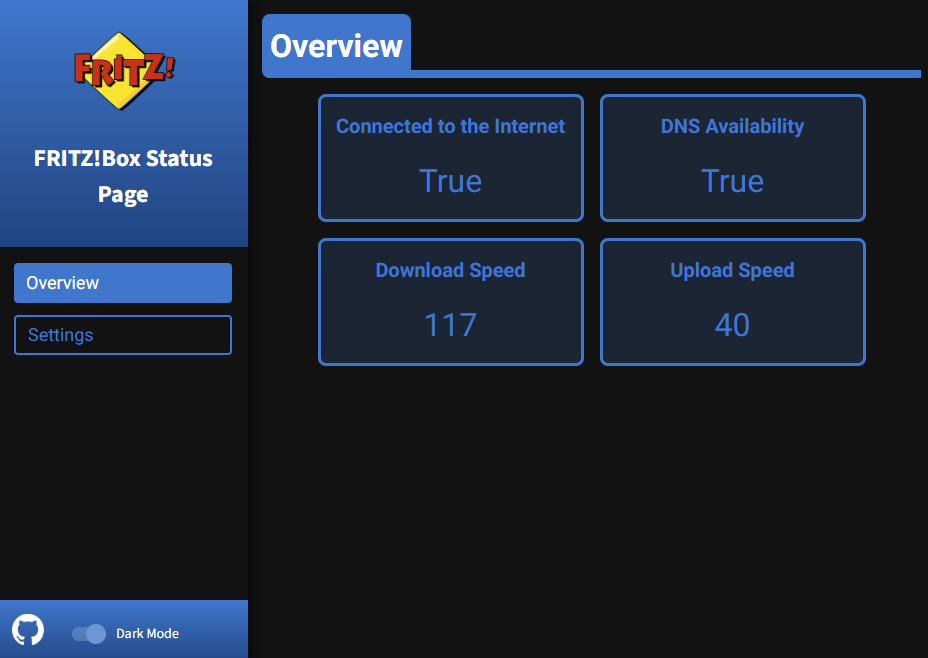
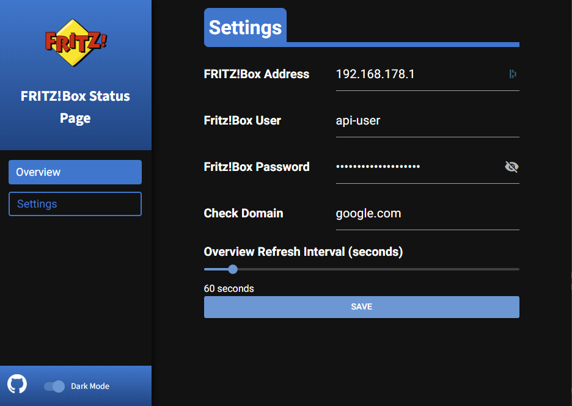
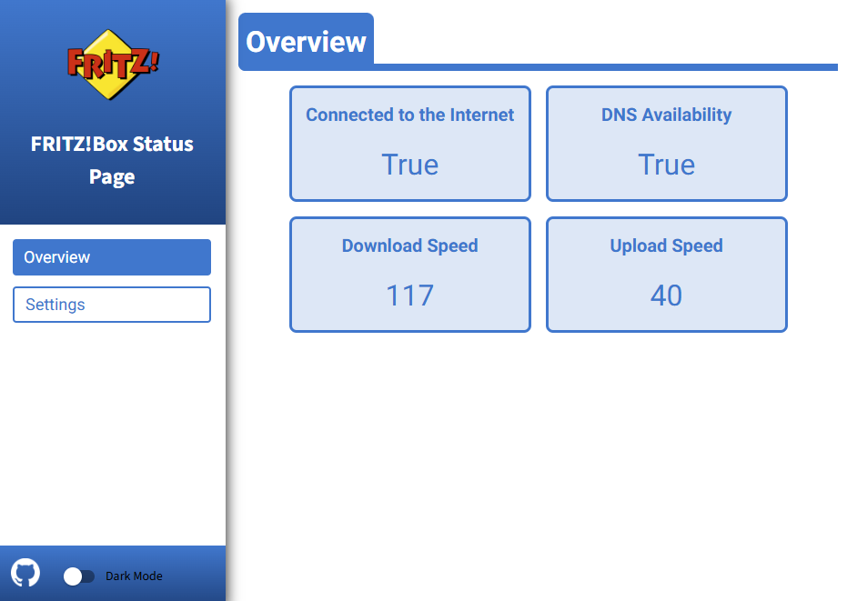
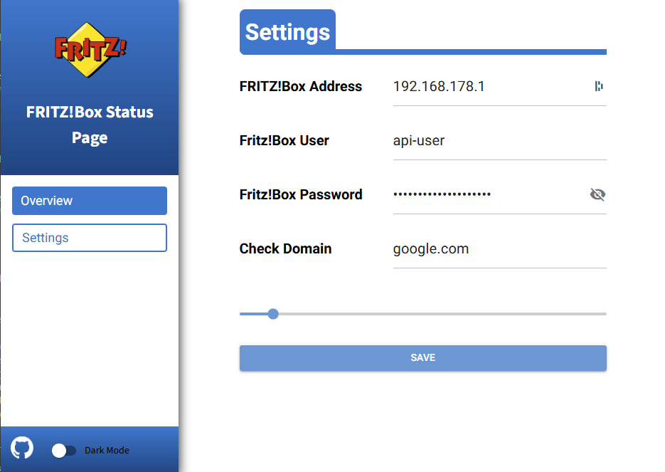

# FRITZ!Box Status Page
A status page for AVM FRITZ!Box routers to easily check internet speed and availability

Overview            |  Settings
:-------------------------:|:-------------------------:
  |  
  |  

- written in Python 3.12.8 using NiceGUI and fritzconnection
- Heavily inspired by Speedtest-Tracker from @alexjustesen : https://github.com/alexjustesen/speedtest-tracker

### CAUTION: BETA! You've been warned (works pretty well though)

## Requirements:
- AVM FRITZ!Box router
    - A dedicated user account for connecting to the router via API: https://en.avm.de/service/knowledge-base/dok/FRITZ-Box-7590/1522_Accessing-FRITZ-Box-from-the-home-network-with-user-accounts/
- Docker or docker compose
- x86 or ARM CPU

## Docker compose file:
```yaml
services:
  fritzbox-status-page:
    image: ghcr.io/maze404/fritzbox-status-page:main
    container_name: fritzbox-status-page
    ports:
      - "8000:8080"
    volumes:
      - /YOUR/CUSTOM/PATH/config:/app/config #Optional, but will make the settings persistent
      - /YOUR/CUSTOM/PATH/log:/app/log #Optional, except if you want to have a look at the logs
    restart: unless-stopped
```

## Docker run command:
```sh
docker run -d --name fritzbox-status-page -p 8000:8080 -v /YOUR/CUSTOM/PATH/config:/app/config -v /YOUR/CUSTOM/PATH/log:/app/log ghcr.io/maze404/fritzbox-status-page:main 
```

## Run without Docker:
*(Seriously why would you do that...)*
1. Download this repository
2. Make sure you have Python 3.12.8 installed
3. Upack the downloaded .zip folder and navigate into that folder using the commandline
4. Install Python 3.12.8 (https://www.python.org/downloads/release/python-3128/)
5. Run `python -m venv .venv`
6. Run `.\.venv\Scripts\Activate.ps1` in Windows, or `source .venv/bin/activate` in MacOS/Linux/Android/Amazon Fire TV Stick/etc.
7. Run `pip install -r requirements.txt`
8. Run `python3 bin/main.py`

*This is highly unrecommended except you want to participate in developing this!*


## ToDo's:
- [x] Show if the router is currently connnected to the internet
- [x] Show upload and download speed
- [x] Show if DNS is working
- [x] Settings page for entering router IP and user credentials, DNS domain to check against, etc.
- [x] Implement a refresh interval that can be customized
- [x] Move settings to its own page instead of the overview page
- [x] Create docker build for this program
- [x] Toggle darkmode on/off
- [x] After setup, make top left logo redirect to router webinterface
- [x] Refine the UI for light/darkmode usage and readability
- [ ] Show Diagrams for keeping track of the upload and download speeds (Idea taken from https://github.com/alexjustesen/speedtest-tracker )
- [ ] Show router log messages on extra page
- [ ] Add a button to restart the router if needed
    - [ ] Add an option to restart the router as soon as it looses internet connection
- [ ] Add a button to enable or disable the router's wifi

I'm sorry if the code is messy, this is my first project in python and i have little to no clue about object orientation :)

If you have any more ideas, feel free to contribute to the project or send me a message!

*If you're someone who works at AVM: Hi! I love your routers!*
